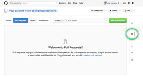

##README

The actual table is at: [tablified-github-repositories.md](tablified-github-repositories.md).

It's coded with [GitHub Flavored Markdown](https://help.github.com/articles/github-flavored-markdown/).  (Shortcut to table formatting: [#Tables](https://help.github.com/articles/github-flavored-markdown/#tables).)

How to format links is covered at: [Markdown Basics/#Links](https://help.github.com/articles/markdown-basics/#links).

To issue or review a pull request, click on the appropriate tab:  

